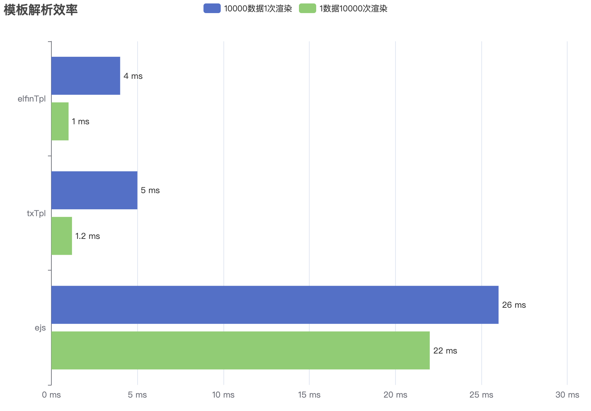

# html-template 前端html模板解析引擎

### CDN
```html
<script src="https://rengar-1253859411.file.myqcloud.com/libs/elfinTpl/1.0.0/index.min.js"></script>
```

## elfin tpl

在原生网页(推荐`移动端`)中，无需 React、Vue 等框架，将html模板解析为相应的节点元素；

理念基于 ejs 模板引擎，本质可以理解为一个字符串拼接工具；

1.1 功能：
- 小体量，仅`1.24KB`大小；
- 支持数据交互（对象、数组、字符串...）（推荐将数据摊平降低复杂度；
- 支持基本语法: if、for操作；
- 支持事件绑定: onclick、onmouseover...；
- 缓存模板解析结果（相同模板再次操作效率更好，默认缓存；
- 高效率，一次遍历完成输出；
- 可调试（代码报错可在控制台中调试）；

1.2 常用标签：
- <% %> 流程控制标签 ==> 转化为逻辑判断；
- <%= %> 输出标签（原文输出HTML标签）==> 转化为字符串累加；
- <%# %> 注释标签；

1.3 缺陷：
- 仅支持固定的模板格式，不支持自定义；

1.4 性能测试：

- 10000条数据1次渲染：4ms；
- 1条数据10000次渲染：1ms；



## demo
```html
<div id="demo"></div>

<script id="demo_tpl" type="text/html">
  <%# comment %>
  <% if (list.length > 0) { %>
    <% for (i = 0, l = list.length; i < l; i++) { %>
      <div class="img_item <%= list[i] %>" onclick="hanldClick()">
        <%= list[i] %>
      </div>
    <% } %>
  <% } %>
</script>

<script src="https://rengar-1253859411.file.myqcloud.com/libs/elfinTpl/1.0.0/index.min.js"></script>
<script>
  let list = ['demo'];

  document.querySelector('#demo').innerHTML = elfinTpl(
    document.querySelector('#colorRange_tpl').innerHTML,
    { list },
  );

  function hanldClick() {};
</script>
```

## 原理

### 2.1 text/html
type属性定义script元素包含或`src`引用的脚本语言。属性的值为MIME类型; <br/>
支持的MIME类型包括`text/javascript`, `text/ecmascript`, `application/javascript`, 和`application/ecmascript`。<br/>
如果没有定义这个属性，脚本会被视作JavaScript。

<b>如果MIME类型不是JavaScript类型（上述支持的类型），则该元素所包含的内容会被当作数据块而不会被浏览器执行。</b>

### 2.2 Function动态函数
**`Function` 是构造函数，可以通过 new Function 创建新的可执行函数；**

- 参数支持数组作为参数名列表；

```jsx
new Function ([arg1[, arg2[, ...argN]],] functionBody)
new Function (arg1[, arg2[, ...argN]], functionBody)

new Function(['data1', 'data2'], functionBody)
new Function('data1', 'data2', functionBody)
```
### 2.3 模板解析
- 遍历字符串，依次记录 `遍历字符`，存入 `tokens`；
- 当遇到 `<%=`、`<%#`、`<%`、`%>` 时，根据相应的类型将 `tokens` 加入到 `s` 中;
- 最终将可执行串 `字符串s` 放入 `new Function()` 中执行，返回最终结果；

```javascript
<%# comment %>
<% if (list.length > 0) { %>
  <% for (i = 0, l = list.length; i < l; i++) { %>
    <div class="img_item <%= list[i] %>">
      <%= list[i] %>
    </div>
  <% } %>
<% } %>

`var s = '';\n s += '<\!--  comment  -->';\n s += '  ';\n if (list.length > 0) { \n s += '    ';\n for (i = 0, l = list.length; i < l; i++) { \n s += '      <div class="img_item ';\n s +=  list[i] ;\n s += '">        ';\n s +=  list[i] ;\n s += '      </div>    ';\n } \n s += '  ';\n } \n ;\n return s;`

new Function() 执行
```

### 2.4 错误调试

`new Function()` 、 `eval` 调试困难，即使其中的代码报错，也无法提示代码报错的具体位置；<br/>
通过在 window定义一个数据，在该数据上模拟 调用new Function()方法，即可进行调试代码。

```javascript
var _variable = "elfinTpl" + Date.now();
_varString = "var " + _variable + "=" + fn.toString();
// ... 获取DOM
_script.innerHTML = _varString;
// 动态添加 script标签，运行代码，在 winodw 上添加变量 _variable
_head.appendChild(_script);
_head.removeChild(_script);
// 运行 window[_variable] 方法进行调试代码
e[_variable].apply(e, dataValue);
```

